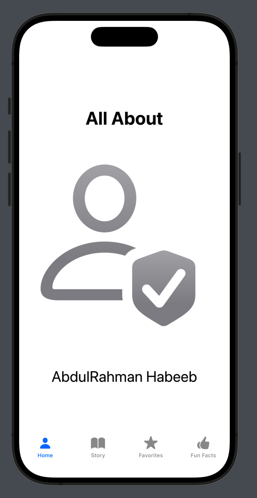
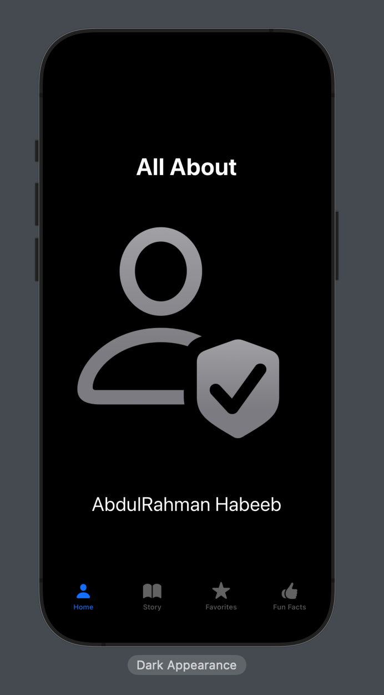
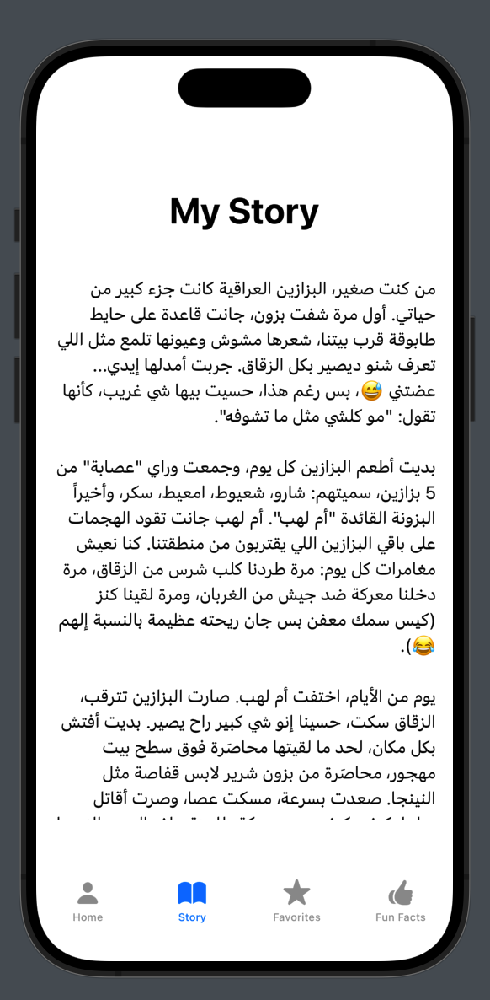
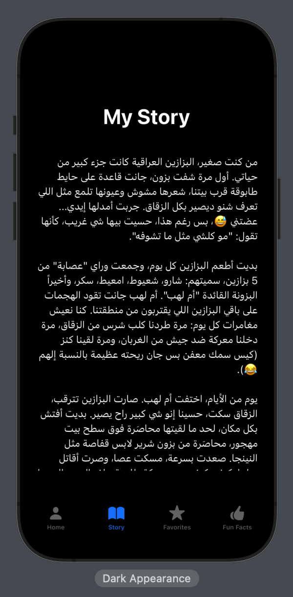
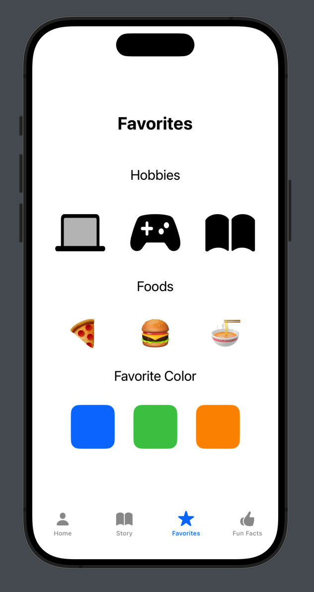
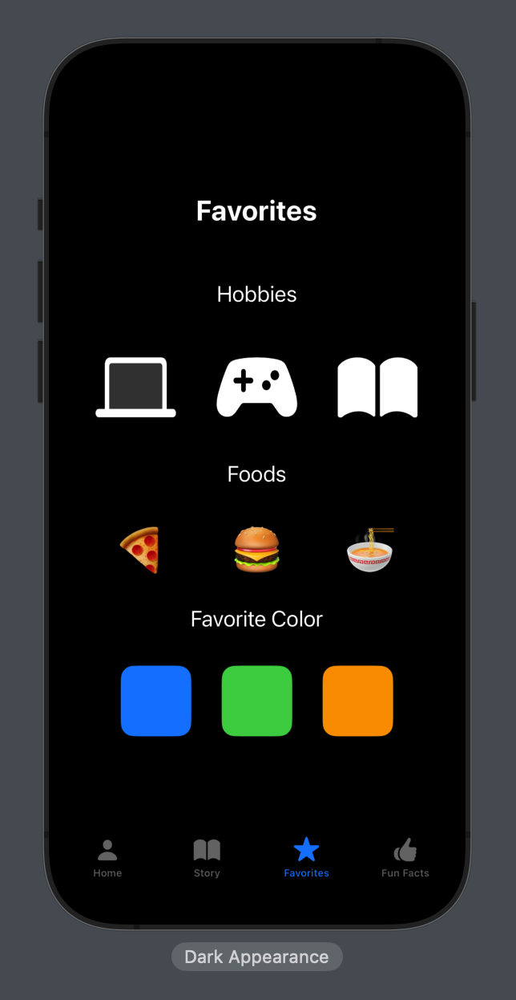
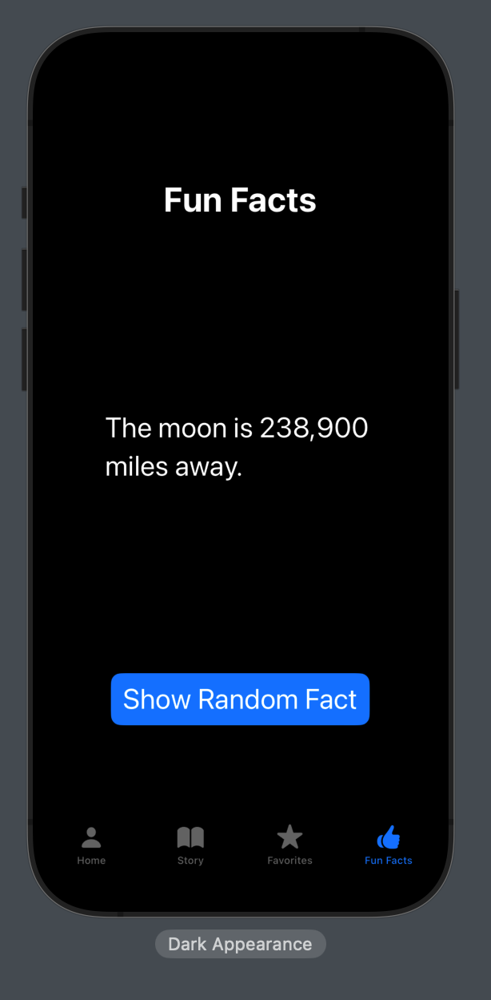

# 👤 SwiftUI About Me App

A multi-tab SwiftUI application that showcases personal information, a story, favorite things, and fun facts in a clean, user-friendly interface. Built using SwiftUI's `TabView`.

---

## 📱 App Structure

This app contains 4 main views:

- **Home** – Display of user info and image.
- **Story** – A personal story or background.
- **Favorites** – Favorite items or experiences.
- **Fun Facts** – Light and fun personal facts.

---

## 🧰 Technologies Used

- **SwiftUI**
- **Xcode 15+**
- **iOS 17+ Compatible**

---

## 📸 Screenshots

> 💡 Place all screenshot images in a folder named `screenshots/`.

### 🏠 Home View

| Light Mode | Dark Mode |
|------------|-----------|
|  |  |

---

### 📖 Story View

| Light Mode | Dark Mode |
|------------|-----------|
|  |  |

---

### ⭐ Favorites View

| Light Mode | Dark Mode |
|------------|-----------|
|  |  |

---

### 👍 Fun Facts View

| Light Mode | Dark Mode |
|------------|-----------|
|  |  |

---

## 🚀 How to Run

1. Open the project in **Xcode**.
2. Select a **simulator** or a connected device.
3. Press **Run (⌘ + R)**.

---

## 👨‍💻 Author

**AbdulRahman Habeeb**  
📅 Created on: 22/06/2025

---

## 📝 License

This project is open-source and free to use for educational and personal projects.
